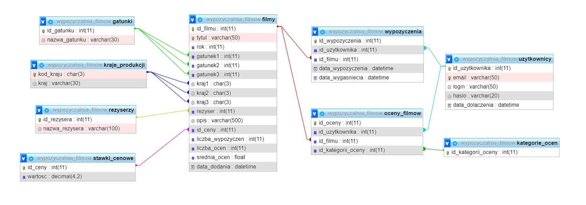

# wypozyczalnia_filmow_online
Baza danych MySQL oraz połączona z nią strona internetowa.

Projekt zaliczeniowy przedmiotu bazy danych na studiach. 
Wykonany został w okresie kwiecień/maj 2021 roku.

Głównym celem projektu było stworzenie relacyjnej bazy danych pod wypożyczalnie filmów online. 
Potem doszedł pomysł stworzenia strony internetowej połączonej z tą bazą danych.

